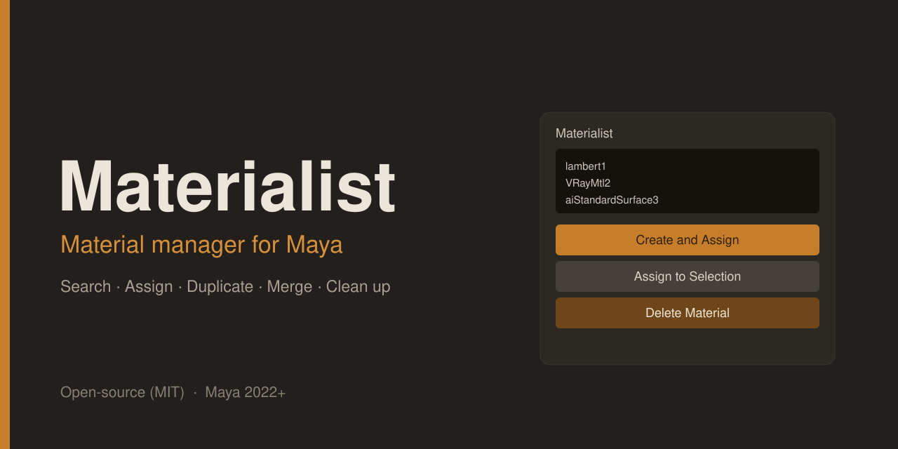
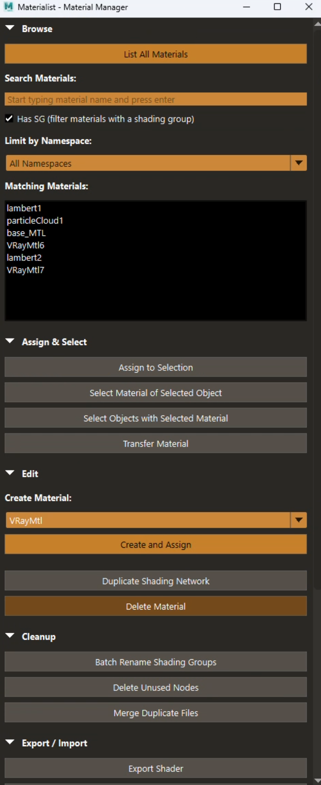
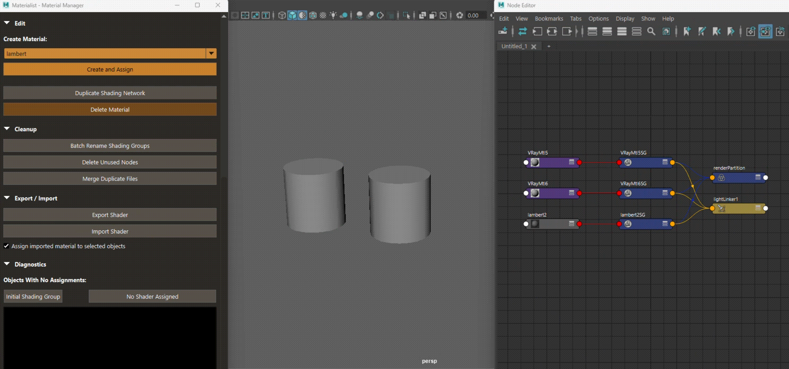
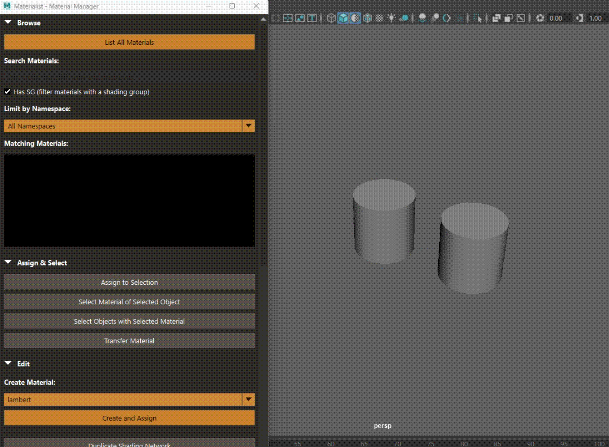
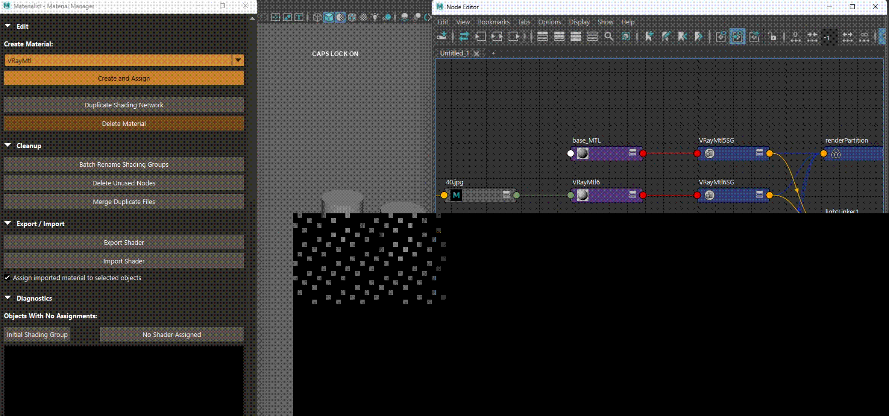

# Materialist — Material Manager for Maya

A lightweight shelf tool for finding, assigning, duplicating, cleaning up, and
exporting materials and shading networks in Autodesk Maya.



## Features



**Browse**
- List every material in the scene, with live search by name
- Filter to materials that have a shading group
- Filter by namespace

**Assign & select**
- Assign the selected material to the selected objects
- Show all materials assigned to the selected object, including face assignments
- Select all objects or exact faces using a material
- Transfer a material from a source object to target objects

**Edit**
- Create a material — Lambert, Blinn, Phong, Standard Surface, plus any
  installed renderer materials (e.g. `aiStandardSurface`, `VRayMtl`,
  `RedshiftMaterial`) — and assign it to the selection
- Duplicate a material into a new shading group with clean, unique names (no
  `pasted__` prefix or numbered suffix), preserving its displacement and volume
  shaders
- Delete a material and its shading group

**Cleanup**
- Batch-rename shading groups to match their shader
- Delete unused nodes
- Merge duplicate file-texture nodes onto one shared node

**Export / import**
- Export a shader's full upstream network to a `.ma` file
- Import a shader, optionally assigning it to the selection

**Diagnostics**
- Find objects still on the initial shading group
- Find objects with no shader assigned

Collapsible sections remember their state, the window remembers its size and
position, and most actions are repeatable with Maya's repeat-last (`G`).

## Demos

**Create & assign a material**



**Assign & select**



**Cleanup**



## Requirements

- Autodesk Maya 2022 or newer (Python 3)

## Installation

1. Copy `materialist.py` into your Maya scripts folder:
   - Windows: `C:\Users\<you>\Documents\maya\scripts\`
   - macOS: `~/Library/Preferences/Autodesk/maya/scripts/`
   - Linux: `~/maya/scripts/`
2. Restart Maya, or refresh the Python script path.

## Usage

Run in the Script Editor (Python tab), or from a shelf button:

```python
import materialist
materialist.show()
```

### Make a shelf button

1. Paste the two lines above into a **Python** tab of the Script Editor.
2. Select the text and middle-mouse-drag it onto a shelf (or use
   **File > Save Script to Shelf**).

## License

MIT — see [LICENSE](LICENSE).

## Author

Ruxin Liang — [Behance](https://www.behance.net/ruxin-liang)
